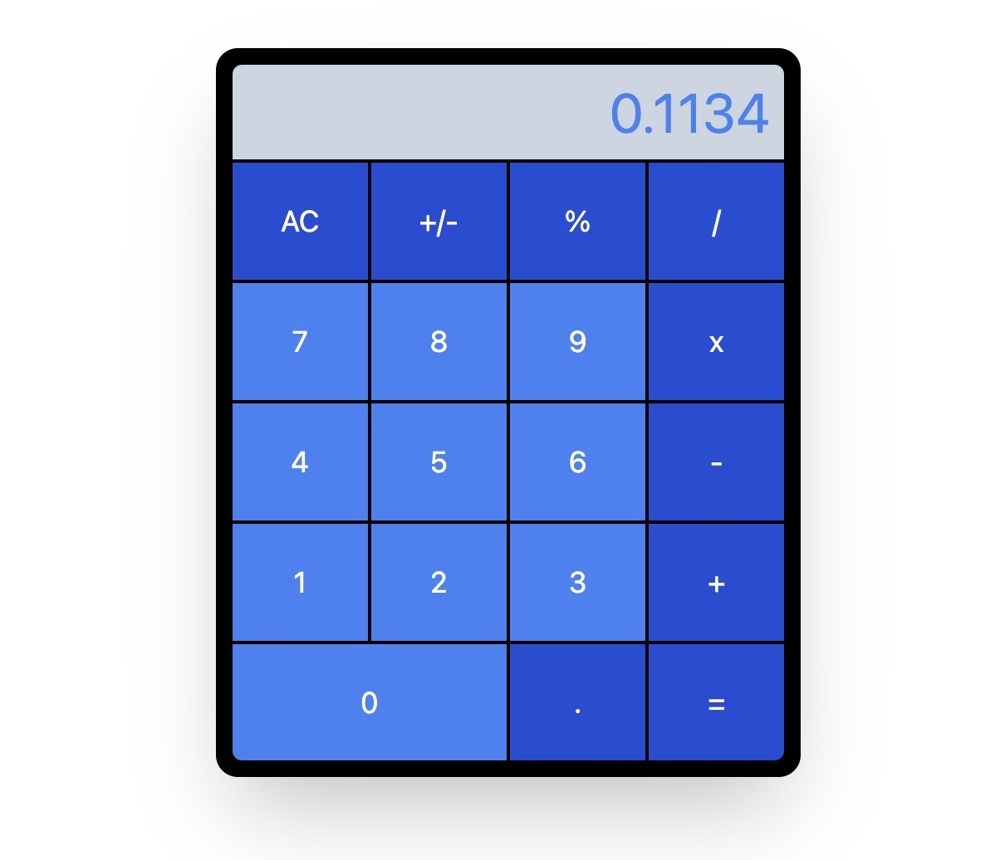

# Calculator

A quick and easy project using React and Tailwind to create a functioning calculator.

## Table of contents

- [My process](#my-process)
  - [Link](#link)
  - [Built with](#built-with)
  - [What I learned](#what-i-learned)
  - [Continued development](#continued-development)

## My process

### Link
 [Calculator](http://calculator-gm.vercel.app)

### Built with

- HTML
- Tailwind CSS
- Javascript
- React

### What I learned

Although this was a quick and easy project, it was not without its challenges.  Because I did not use typescript, it was very important to pay attention to the types I was using.  I wanted to have two pieces of state: `total` and `input` where total was a `Number` and dealt with calculations, while `input` was a `String` and used for display purposes and allowing to concatenate the numbers upon input.  

This proved troublesome as they kept switching types and I had to pay close attention to what type I was working with when executing calculations.

### Continued development

Something that I really would like to implement is that the calculations happen upon clicking an operation.